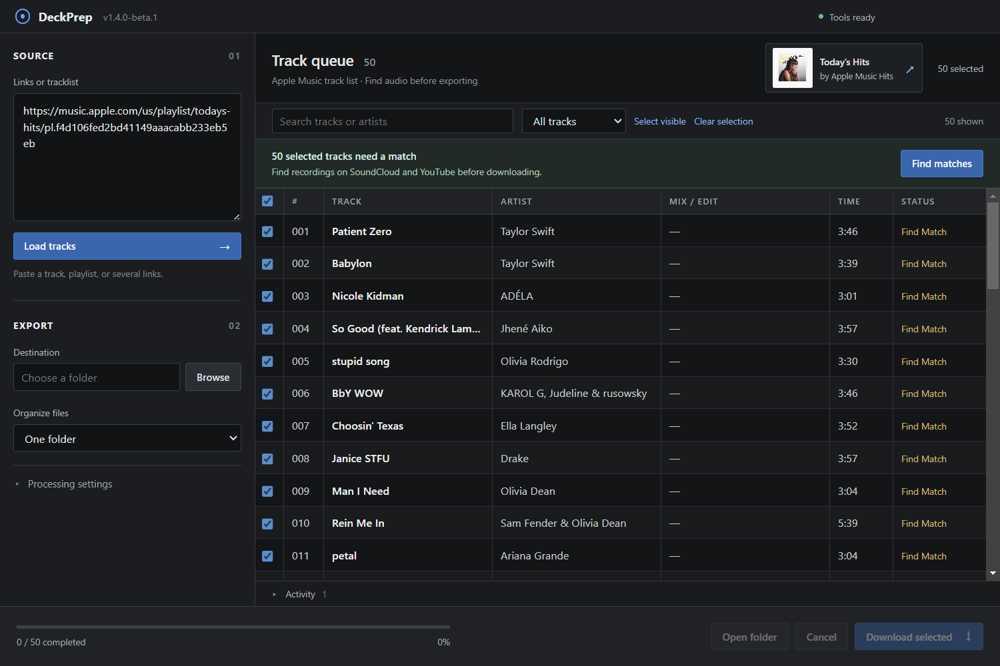
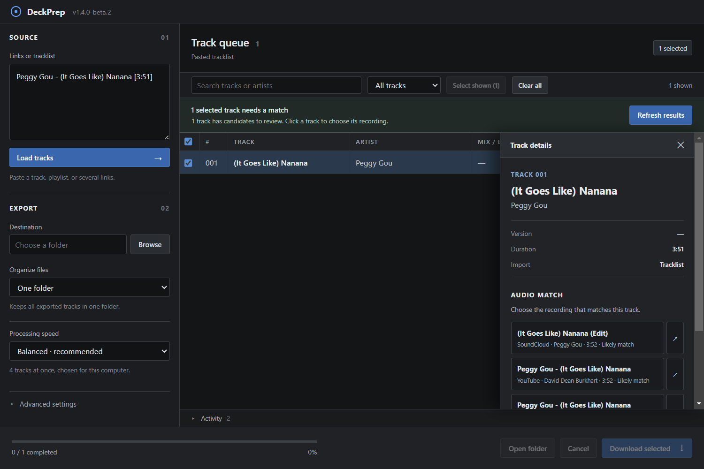

# DeckPrep

DeckPrep is a Windows desktop workspace for preparing DJ crates from public music links and pasted tracklists. Load a playlist, review the tracks and audio matches, choose what to export, and follow each file through to a tagged MP3. The queue can be restored after an interrupted session.

**Current version:** 1.4.0-beta.4 · [Roadmap](ROADMAP.md) · [Changelog](CHANGELOG.md)



## How it works

1. Paste a public track, album, or playlist link, several links on separate lines, or an artist–title tracklist. Click **Load tracks**.
2. Search and filter the queue, inspect a track, and uncheck anything you do not want. **Select shown** selects only rows in the current search/filter; **Clear all** deselects the whole queue. SoundCloud playlists fill in track titles and artists before audio downloads start.
3. For catalog-only imports and tracklists, click **Find matches**. DeckPrep searches YouTube first, then SoundCloud when a track still needs a match. It compares artist, title, version, and available duration, accepts close matches automatically, and leaves uncertain versions for review.
4. Choose a destination and click **Download selected**. Watch per-track status, review the batch summary, and select failed rows to retry.
5. If you close the app before finishing, it asks whether to restore or discard the saved queue when reopened. Restoring does not start downloads.



## Public link support

| Source | Import | Audio handling |
| --- | --- | --- |
| SoundCloud | Public tracks and playlists; fast title, artist, and artwork review | Uses the original link when available |
| YouTube / YouTube Music | Public videos and playlists | Uses the original video link |
| Spotify | Public embed metadata for tracks, albums, and playlists | Finds candidate recordings on supported audio sources; does not extract Spotify streams |
| Apple Music | Public song, album, and playlist page metadata | Finds candidate recordings on supported audio sources; does not extract Apple Music streams |
| Pasted tracklist | Artist–title lines, with optional mix and duration | Finds candidate recordings for review |

Public pages can change or expose only part of a playlist. DeckPrep reports an incomplete Apple Music import and warns that Spotify's public preview cannot verify the full playlist length. Paste a complete tracklist if tracks are missing. Private playlists and account connections are planned for later. SoundCloud's quick public metadata does not always include duration.

## Export

- MP3 at 320 kbps and 44.1 kHz stereo, with ID3 tags and artwork when available. Encoding cannot improve the quality of its source.
- One-folder and artist/genre folder layouts. The **DJ Sampler Bank folder** option creates a named folder of full-length tracks; it does not chop audio or create sampler pads.
- **Balanced**, **Lower computer usage**, and **Faster** processing presets choose how many separate tracks run at once. Advanced settings allow a specific number. This is not a CPU thread count.
- Concurrent downloads, per-track errors, cancellation, existing-file checks, and retry selection.
- Match searches use the processing-speed setting with a bounded number of parallel jobs. Saved candidate lists are rescored when restoring a session, without searching again.
- Original source files remain untouched; output is checked before being marked complete.

## Develop on Windows

Requires Node.js 22 or newer.

```powershell
npm ci
npm run setup:engine
npm start
```

`setup:engine` downloads a pinned, checksum-verified `yt-dlp` executable. FFmpeg is provided by `ffmpeg-static`.

```powershell
npm test
npm run dist:portable
```

The portable executable is written to `dist/`. Pull requests run the Windows test and packaging workflow. Release builds are versioned in `package.json` and recorded in the changelog; beta builds use `1.4.0-beta.N` until the 1.4.0 release is ready.

DeckPrep is independent of the named music and DJ software services. Use links and audio according to the applicable terms and permissions.
