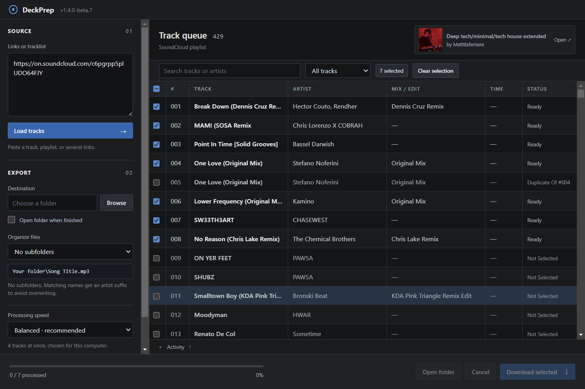
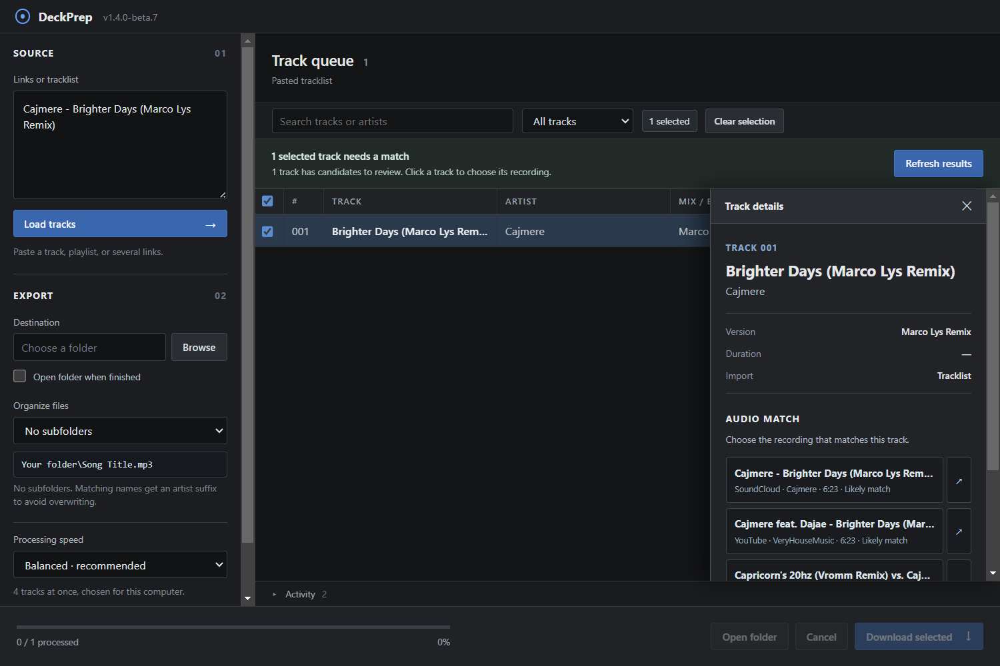

# DeckPrep

DeckPrep is a Windows desktop workspace for preparing DJ crates from public music links, pasted tracklists, and owned audio files. Load a playlist, review the tracks and audio matches, choose what to export, and follow each file through to a tagged MP3. The queue can be restored after an interrupted session.

**Current source version:** 1.4.0-beta.10 · [Roadmap](ROADMAP.md) · [Changelog](CHANGELOG.md) · [Master plan](docs/MASTER_PLAN.md) · [Progress](docs/PROGRESS.md) · [Interactive redesign concept](prototypes/deckprep-concept.html) (sample data, not the app)



## How it works

1. Paste a public track, album, or playlist link, several links on separate lines, or an artist–title tracklist. Click **Load tracks**.
2. Search and filter the queue, inspect a track, and uncheck anything you do not want. Shift-click a row checkbox to select or clear the range from the last checkbox; Ctrl-click a row to toggle it. The checkbox at the top selects or clears all **shown** rows, and **Clear selection** clears the whole queue. Repeated artist/title/version entries are marked as possible duplicates, with later copies unchecked by default. SoundCloud playlists fill in track titles and artists before audio downloads start.
3. For catalog-only imports and tracklists, click **Find matches**. DeckPrep searches YouTube first, then SoundCloud when a track still needs a match. It compares artist, title, version, and available duration, accepts close matches automatically, and leaves uncertain versions for review.
4. Choose a destination and click **Download selected**. Watch per-track status and review the batch summary. If a source cannot provide exportable audio, DeckPrep searches for another recording and continues with a confident match. Uncertain results wait for you in the track detail view. Other failed rows can be selected for retry.
   Turn on **Open folder when finished** beside the destination if you want File Explorer to appear after a successful batch. It is off by default; **Open folder** remains available at the bottom of the app.
5. If you close the app before finishing, it asks whether to restore or discard the saved queue when reopened. Restoring does not start downloads.



## Audio review and local crates

Use **Add audio files** or **Add folder** for MP3, WAV, FLAC, AIFF, or M4A. Embedded tags are read on import; filenames are used when tags are missing. The actual codec and full audio are checked during preparation. Original files stay untouched. Compatible local MP3s are copied without re-encoding unless you approve a trim.

When a long quiet tail is detected, the track shows **Review ending**. Open its details, listen with the waveform/player, and choose **Keep full recording** or **Approve trimmed export**. Adjust the endpoint in seconds if needed. Then choose **Download selected** to finish the approved export. This button also prepares local files. Other tracks can finish while one waits for review. The detection is a review aid, not proof of where music artistically ends.

Use **Export crate** to generate an ordered relative-path M3U8 and report beside verified files. In Rekordbox use File → Import → Import Playlist. Actual Rekordbox-version and hardware acceptance remain pending; DeckPrep does not modify Rekordbox databases or write device databases.

This development beta is not a stable release. [Testing and remaining acceptance gates](docs/TESTING.md) include multi-machine use, representative matching accuracy, actual Rekordbox import, accessibility checks, signing, and exact binary redistribution review. Public provider availability can change. Inspection supports recordings up to two hours; network/process stages have bounded timeouts. Diagnostics are explicit and omit music titles, source URLs and local paths by default. No telemetry or music uploads are added.

## Public link support

| Source | Import | Audio handling |
| --- | --- | --- |
| SoundCloud | Public tracks and playlists; fast title, artist, and artwork review | Uses the original link when available |
| YouTube / YouTube Music | Public videos and playlists | Uses the original video link |
| Spotify | Public embed metadata for tracks, albums, and playlists | Finds candidate recordings on supported audio sources; does not extract Spotify streams |
| Apple Music | Public song, album, and playlist page metadata | Finds candidate recordings on supported audio sources; does not extract Apple Music streams |
| Pasted tracklist | Artist–title lines, with optional mix and duration | Finds candidate recordings for review |

Public pages can change or expose only part of a playlist. DeckPrep reports an incomplete Apple Music import and warns that Spotify's public preview cannot verify the full playlist length. Paste a complete tracklist if tracks are missing. Private playlists and account connections are planned for later. SoundCloud's quick public metadata does not always include duration.

## Export

- Newly encoded MP3 at 320 kbps and 44.1 kHz stereo, with ID3 tags and artwork when available. Encoding cannot improve the quality of its source.
- Files are named `Song Title.mp3` or `Song Title (Mix).mp3`, without playlist numbers. If two different tracks would use the same name, DeckPrep adds the artist as a suffix. Existing outputs are reused only when their DeckPrep identity manifest, content hash, and decoded audio agree. Legacy files are preserved and a new name is chosen.
- **No subfolders:** `Destination\Song Title.mp3`. **Folders by artist:** `Destination\Artist\Song Title.mp3` (missing names use `Unknown Artist`). **Folders by genre:** `Destination\Genre\Song Title.mp3`; DeckPrep reads genre during export when available and uses `Unknown Genre` when the source has none. **DJ Sampler Bank subfolder:** `Destination\DJ Sampler Bank\Song Title.mp3`; this only changes the folder, without creating pads or cue points. Short SoundCloud previews remain rejected in every layout.
- The Album tag is filled only when the source supplies a real album. A playlist name is not used as the album.
- **Balanced**, **Lower computer usage**, and **Faster** processing presets choose how many separate tracks run at once. Advanced settings allow a specific number. This is not a CPU thread count.
- Concurrent downloads, per-track errors, cancellation, existing-file checks, and retry selection.
- Match searches use the processing-speed setting with a bounded number of parallel jobs. Saved candidate lists are rescored when restoring a session, without searching again.
- Original source files remain untouched; output is checked before being marked complete.

## Develop on Windows

Requires Node.js 22.12 or newer (CI uses Node.js 24).

```powershell
npm ci
npm run setup:desktop
npm run setup:engine
npm start
```

`setup:engine` downloads a pinned, checksum-verified `yt-dlp` executable. FFmpeg is provided by `ffmpeg-static`.

```powershell
npm test
npm run test:desktop
npm run test:scale
npm run dist:portable
```

The portable executable is written to `dist/`. Pull requests run the Windows test and packaging workflow. Release builds are versioned in `package.json` and recorded in the changelog; beta builds use `1.4.0-beta.N` until the 1.4.0 release is ready.

DeckPrep is independent of the named music and DJ software services. Use links and audio according to the applicable terms and permissions.
